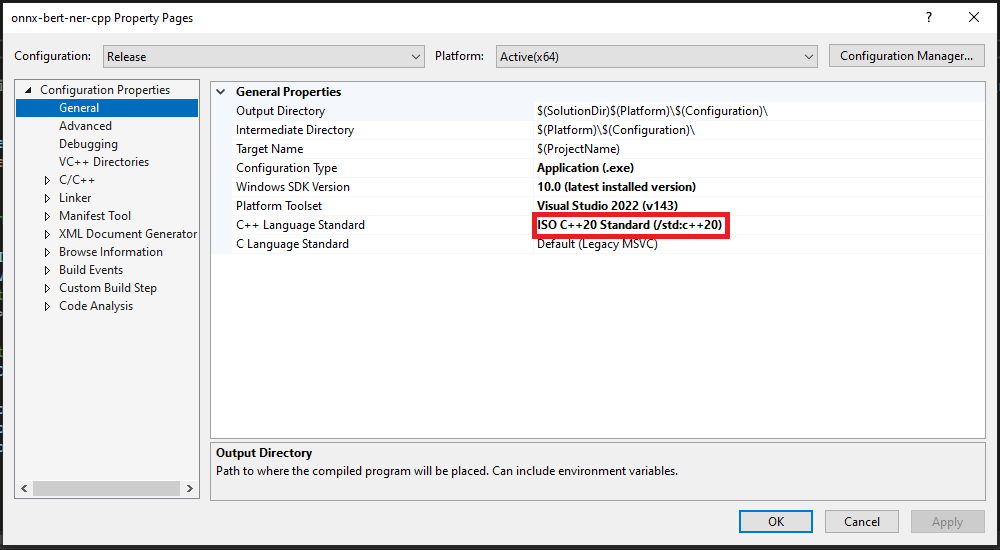
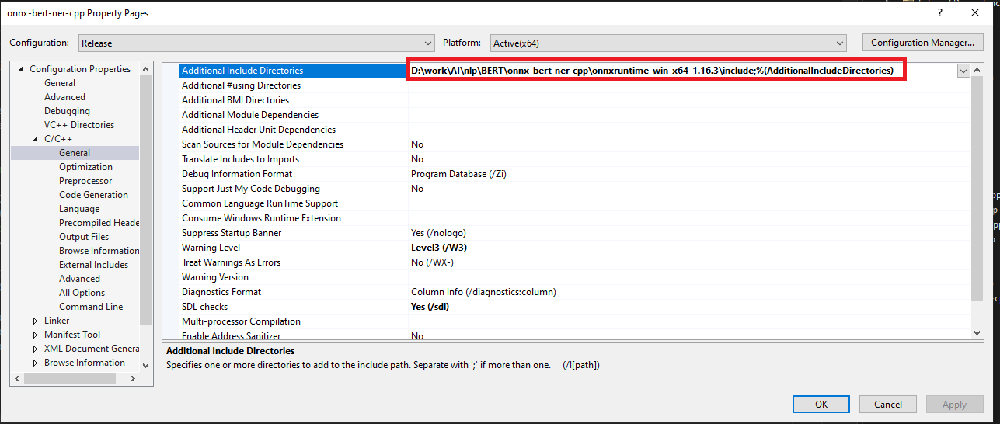
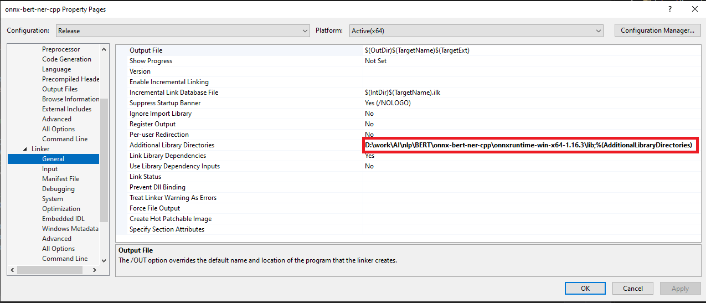
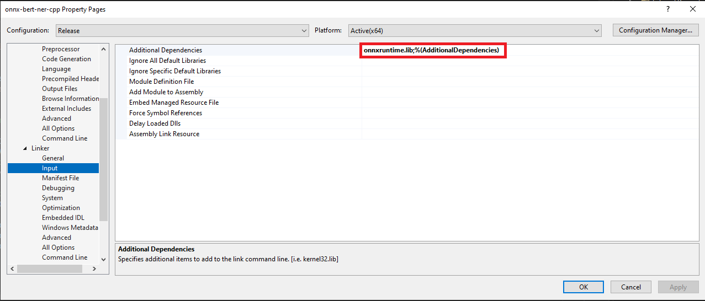

# Tiny Bert Inference for multiple functions on Windows

## Introduction
This project is a tiny bert inference demo on windows.

## How to run the project
- BertModel: https://drive.google.com/file/d/13ssPpWVsy7zvazTmh2OzKyISjgheT9TA/view?usp=sharing
- OnnxRuntime: https://sourceforge.net/projects/onnx-runtime.mirror/files/v1.16.3/   
`onnxruntime-win-x64-1.16.3.zip`
1. 

2. 

3. 

4. 

5. `12 string onnxmodel_dir = "D:/work/AI/nlp/BERT/onnx/model.onnx";`
Change the model path.

6. Copy onnxruntime.dll to excution file directory.

## References
- https://github.com/yinmingjun/TinyBERT
- https://huggingface.co/docs/transformers/model_doc/distilbert
- https://towardsdatascience.com/tinybert-1a928ba3082b
- https://towardsdatascience.com/distilbert-11c8810d29fc